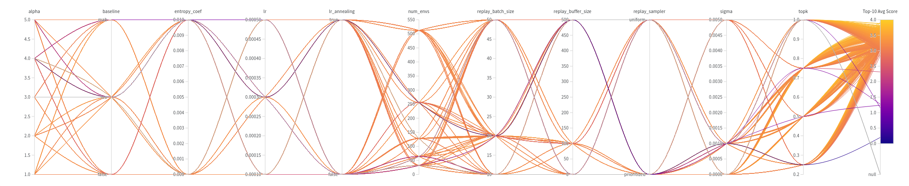

<p align="center">
  
</p>

# ACEGEN: A TorchRL-based toolkit for reinforcement learning in generative chemistry

[](https://github.com/Acellera/acegen-open/blob/main/LICENSE)
[](https://github.com/Acellera/acegen-open/tree/main/tutorials)
[](https://www.python.org/downloads/)
[](https://arxiv.org/abs/2405.04657)
[](https://doi.org/10.1021/acs.jcim.4c00895)
[](https://github.com/Acellera/acegen-open/actions/workflows/unit_tests.yml)


---

## Overview

ACEGEN is a comprehensive toolkit designed to leverage reinforcement learning (RL) techniques for generative chemistry tasks, particularly in drug design. ACEGEN harnesses the capabilities of [TorchRL](https://github.com/pytorch/rl), a modern library for general decision-making tasks, to provide a flexible and integrated solution for generative drug design challenges.

---

## Key Features

- 🚀 __**Multiple Generative Modes:**__ 
ACEGEN facilitates the generation of chemical libraries with different modes: de novo generation, scaffold decoration, and fragment linking.

- 🤖 __**RL Algorithms:**__ 
ACEGEN offers task optimization with various reinforcement learning algorithms such as [Proximal Policy Optimization (PPO)][1], [Advantage Actor-Critic (A2C)][2], [Reinforce][3], [Reinvent][4], and [Augmented Hill-Climb (AHC)][5].

- 🔍 __**Other Algorithms:**__ 
ACEGEN also includes [Direct Preference Optimization (DPO)][8] and Hill Climbing.

- 🧠 __**Pre-trained Models:**__ ACEGEN contains pre-trained models including Gated Recurrent Unit (GRU), Long Short-Term Memory (LSTM), GPT-2, LLama2 and Mamba.

- 🧪 __**Scoring Functions :**__ 
ACEGEN defaults to MolScore, a comprehensive scoring function suite for generative chemistry, to evaluate the quality of the generated molecules. MolScore allows to train agents on single scoring functions, on entire benchmarks containing multiple scoring functions (e.g., MolOpt, GuacaMol), or using curriculum learning where the same agent is optimized on a sequence of different scoring functions.

- 🛠️ __**Customization Support:**__ 
ACEGEN provides tutorials for integrating custom models and custom scoring functions, ensuring flexibility for advanced users.

---

## Table of Contents
1. [**Installation**](#1-Installation)
   - [1.1. Conda environment and required dependencies](#11-conda-environment-and-required-dependencies)
   - [1.2. Optional dependencies](#12-optional-dependencies)
   - [1.3. Install ACEGEN](#13-install-acegen)
2. [**Generating libraries of molecules**](#2-generating-libraries-of-molecules)
   - [2.1. Running training scripts to generate compound libraries](#21-running-training-scripts-to-generate-compound-libraries)
   - [2.2. Alternative usage](#22-alternative-usage)
3. [**Advanced usage**](#3-advanced-usage)
   - [3.1. Optimization of Hyperparameters in the Configuration Files](#31-optimization-of-hyperparameters-in-the-configuration-files)
   - [3.2. Changing the scoring function](#32-changing-the-scoring-function)
   - [3.3. Changing the policy prior](#33-changing-the-policy-prior)
     - [3.3.1. Available models](#331-available-models)
     - [3.3.2. Integration of custom models](#332-integration-of-custom-models)
4. [**Results on the MolOpt benchmark**](#4-results-on-the-molopt-benchmark)
5. [**De Novo generation example: docking in the 5-HT2A**](#5-de-novo-generation-example-docking-in-the-5-ht2a)
6. [**Scaffold constrained generation example: BACE1 docking with AHC algorithm**](#6-scaffold-constrained-generation-example-bace1-docking-with-ahc-algorithm)
7. [**Citation**](#7-citation)

---

## 1. Installation 

### 1.1. Conda environment and required dependencies

To create the conda / mamba environment, run

    conda create -n acegen python=3.10 -y
    conda activate acegen

To install the required dependencies run the following commands. Replace `cu121` with your appropriate CUDA version (e.g., `cu118`, `cu117`, `cu102`).

    pip3 install torch torchvision  --index-url https://download.pytorch.org/whl/cu121
    pip3 install flake8 pytest pytest-cov hydra-core tqdm wandb
    pip3 install torchrl


### 1.2. Optional dependencies

Unless you intend to define your own custom scoring functions, install MolScore by running

    pip3 install rdkit==2023.3.3
    pip3 install MolScore

To use the scaffold decoration and fragment linking, install promptsmiles by running

    pip3 install promptsmiles

To learn how to configure constrained molecule generation with ACEGEN and promptsmiles, please refer to this [tutorial](tutorials/using_promptsmiles.md).

### 1.3. Install ACEGEN

To install ACEGEN, run (use `pip install -e ./` for develop mode)

    git clone https://github.com/Acellera/acegen-open.git
    cd acegen-open
    pip install ./

---

## 2. Generating libraries of molecules 

ACEGEN has multiple RL algorithms available, each in a different directory within the `acegen-open/scripts` directory. Each RL algorithm has three different generative modes of execution: de novo, scaffold decoration, and fragment linking.

Each mode of execution has its own configuration file in YAML format, located right next to the script. To modify training parameters for any mode, edit the corresponding YAML file. For a breakdown of the general structure of our configuration files, refer to this [tutorial](tutorials/breaking_down_configuration_files.md).

While the default values in the configuration files are considered sensible, a default scoring function and model architecture are also defined so users can test the scripts out of the box. However, users might generally want to customize the model architecture or the scoring function.

To customize the model architecture, refer to the [Changing the model architecture](#332-integration-of-custom-models) section. To customize the scoring function, refer to the [Changing the scoring function](#32-changing-the-scoring-function) section.

### 2.1. Running training scripts to generate compoud libraries

To run the training scripts for denovo generation, run the following commands:
    
    python scripts/reinforce/reinforce.py --config-name config_denovo
    python scripts/a2c/a2c.py --config-name config_denovo
    python scripts/ppo/ppo.py --config-name config_denovo
    python scripts/reinvent/reinvent.py --config-name config_denovo
    python scripts/ahc/ahc.py --config-name config_denovo
    python scripts/dpo/dpo.py --config-name config_denovo
    python scripts/hill_climb/hill_climb.py --config-name config_denovo


To run the training scripts for scaffold decoration, run the following commands (requires installation of promptsmiles):

    python scripts/reinforce/reinforce.py --config-name config_scaffold
    python scripts/a2c/a2c.py --config-name config_scaffold
    python scripts/ppo/ppo.py --config-name config_scaffold
    python scripts/reinvent/reinvent.py --config-name config_scaffold
    python scripts/ahc/ahc.py --config-name config_scaffold
    python scripts/dpo/dpo.py --config-name config_scaffold
    python scripts/hill_climb/hill_climb.py --config-name config_scaffold

To run the training scripts for fragment linking, run the following commands (requires installation of promptsmiles):

    python scripts/reinforce/reinforce.py --config-name config_linking
    python scripts/a2c/a2c.py --config-name config_linking
    python scripts/ppo/ppo.py --config-name config_linking
    python scripts/reinvent/reinvent.py --config-name config_linking
    python scripts/ahc/ahc.py --config-name config_linking
    python scripts/dpo/dpo.py --config-name config_linking
    python scripts/hill_climb/hill_climb.py --config-name config_linking

### 2.2. Alternative usage

Scripts are also available as executables after installation, but both the path and name of the config must be specified. For example,

    ppo.py --config-path=<path_to_config_dir> --config-name=<config_name.yaml> 

YAML config parameters can also be specified on the command line. For example,

    ppo.py --config-path=<path_to_config_dir> --config-name=<config_name.yaml> total_smiles=100

---

## 3. Advanced usage

### 3.1. Optimization of hyperparameters in the configuration files

The hyperparameters in the configuration files have sensible default values. However, the optimal choice of hyperparameters depends on various factors, including the scoring function and the network architecture. Therefore, it is very useful to have a way to automatically explore the space of hyperparameters.

To learn how to perform hyperparameter sweeps to find the best configuration for a specific problem using [wandb](https://wandb.ai/), follow this [tutorial](tutorials/hyperparameter_optimisation_with_wandb.md).

<p align="center">
  
</p>


### 3.2. Changing the scoring function

To change the scoring function, the easiest option is to adjust the `molscore` parameters in the configuration files. Modifying these parameters allows to switch betwewn different scoring modes and scoring objecitves.
Please refer to the `molscore` section in the configuration [tutorial](tutorials/breaking_down_configuration_files.md) for a more detailed explaination. Additionally, refer to the [tutorials](https://github.com/MorganCThomas/MolScore/tree/main/tutorials) in the MolScore repository.

Alternatively, users can define their own custom scoring functions and use them in the ACEGEN scripts by following the instructions in this other [tutorial](tutorials/adding_custom_scoring_function.md).


### 3.3. Changing the policy prior

#### 3.3.1. Available models

We provide a variety of default priors that can be selected in the configuration file. These include:

- A Gated Recurrent Unit (GRU) model
  - pre-training dataset1 (default): [ChEMBL](https://www.ebi.ac.uk/chembl/)
  - pre-training dataset2: [ZINC250k](https://github.com/wenhao-gao/mol_opt/blob/main/data/zinc.txt.gz)
  - tokenizer: [SMILESTokenizerChEMBL](https://github.com/Acellera/acegen-open/blob/main/acegen/vocabulary/tokenizers.py#L40) 
  - number of parameters: 4,363,045
  - to select set the field `model` to `gru` in any configuration file


- A Long Short-Term Memory (LSTM) model
  - pre-training dataset: [ChEMBL](https://www.ebi.ac.uk/chembl/)
  - tokenizer: [SMILESTokenizerChEMBL](https://github.com/Acellera/acegen-open/blob/main/acegen/vocabulary/tokenizers.py#L40) 
  - number of parameters: 5,807,909
  - to select set the field `model` to `lstm` in any configuration file
 

- A GPT-2 model (requires installation of HuggingFace's `transformers` library)
  - pre-training dataset: [REAL 350/3 lead-like, 613.86M cpds, CXSMILES](https://enamine.net/compound-collections/real-compounds/real-database-subsets)
  - tokenizer: [SMILESTokenizerEnamine](https://github.com/Acellera/acegen-open/blob/main/acegen/vocabulary/tokenizers.py#L133) 
  - number of parameters: 5,030,400
  - to select set the field `model` to `gpt2` in any configuration file


- A Mamba model (requires installation of `mamba-ssm` library)
  - pre-training dataset: [ChEMBL](https://www.ebi.ac.uk/chembl/)
  - tokenizer: [SMILESTokenizerChEMBL](https://github.com/Acellera/acegen-open/blob/main/acegen/vocabulary/tokenizers.py#L40) 
  - number of parameters: 2,809,216
  - to select set the field `model` to `mamba` in any configuration file


- A Llama2 model (requires installation of HuggingFace's `transformers` library)
  - pre-training dataset: [REAL Database, 6B cpds, CXSMILES](https://enamine.net/compound-collections/real-compounds/real-database)
  - tokenizer: [AsciiSMILESTokenizer](https://github.com/Acellera/acegen-open/blob/main/acegen/vocabulary/tokenizers.py#L524C7-L524C27) 
  - number of parameters: 5,965,760
  - to select set the field `model` to `llama2` in any configuration file

#### 3.3.2. Integration of custom models

Users can also combine their own custom models with ACEGEN. A detailed guide on integrating custom models can be found in this [tutorial](tutorials/adding_custom_model.md).

---

## 4. Results on the [MolOpt](https://arxiv.org/pdf/2206.12411.pdf) benchmark 

Algorithm comparison for the Area Under the Curve (AUC) of the top 100 molecules on MolOpt benchmark scoring functions. Each algorithm ran 5 times with different seeds, and results were averaged. 
The default values for each algorithm are those in our de novo configuration files.
Additionally, for Reinvent we also tested the configuration proposed in the MolOpt paper.

| Task                          | [REINFORCE][3] | [REINVENT][4] | [REINVENT MolOpt][6] | [AHC][5]   | [A2C][2]   | [PPO][1]   | [PPOD][7]  |
|-------------------------------|----------------|---------------|----------------------|------------|------------|------------|------------|
| Albuterol_similarity   | 0.68  | 0.69 | 0.90     | 0.77  | 0.82  | 0.93  | **0.94** |
| Amlodipine_MPO         | 0.55  | 0.56 | 0.65     | 0.56  | 0.55  | 0.58  | **0.68** |
| C7H8N2O2               | 0.83  | 0.82 | **0.90**  | 0.76  | 0.84  | 0.89  | 0.89  |
| C9H10N2O2PF2Cl         | 0.70  | 0.70 | 0.76     | 0.68  | 0.69  | 0.66  | **0.79** |
| Celecoxxib_rediscovery | 0.63  | 0.64 | 0.77     | 0.72  | 0.73  | 0.65  | **0.82** |
| DRD2                    | 0.98  | 0.97 | **0.99** | 0.98  | 0.98  | **0.99** | **0.99** |
| Deco_hop                | 0.63  | 0.63 | **0.67** | 0.64  | 0.62  | 0.62  | 0.66  |
| Fexofenadine_MPO        | 0.71  | 0.71 | **0.80** | 0.72  | 0.71  | 0.73  | 0.78  |
| GSK3B                   | 0.84  | 0.84 | **0.92** | 0.82  | 0.85  | 0.90  | **0.92** |
| JNK3                    | 0.75  | 0.75 | 0.85     | 0.75  | 0.74  | 0.80  | **0.87** |
| Median_molecules_1      | 0.26  | 0.24 | **0.36** | 0.24  | 0.31  | 0.33  | 0.35  |
| Median_molecules_2      | 0.22  | 0.22 | 0.28     | 0.24  | 0.25  | 0.25  | **0.29** |
| Mestranol_similarity    | 0.60  | 0.55 | 0.85     | 0.66  | 0.69  | 0.75  | **0.89** |
| Osimertinib_MPO         | 0.82  | 0.82 | **0.86** | 0.83  | 0.81  | 0.82  | 0.84  |
| Perindopril_MPO         | 0.48  | 0.47 | **0.54** | 0.47  | 0.48  | 0.50  | 0.53  |
| QED                     | **0.94**| **0.94** | **0.94** | **0.94** | **0.94** | **0.94** | **0.94** |
| Scaffold_hop              | 0.80  | 0.79 | **0.86** | 0.80  | 0.80  | 0.80  | 0.84  |
| Sitagliptin_MPO           | 0.34  | 0.33 | 0.38     | 0.33  | **0.39** | 0.32 | **0.39** |
| Thiothixene_rediscovery   | 0.41  | 0.41 | 0.56     | 0.45  | 0.48  | 0.48  | **0.58** |
| Troglitazone_rediscovery  | 0.31  | 0.31 | 0.47     | 0.34  | 0.35  | 0.46  | **0.52** |
| Valsartan_smarts          | **0.03** | 0.02 | 0.02     | 0.02  | 0.02  | **0.03** | **0.03** |
| Zaleplon_MPO              | 0.47  | 0.47 | **0.52** | 0.48  | 0.47  | 0.50  | **0.52** |
| **Total**                 | **13.67**    | **13.60**   | **15.65**       | **13.91**    | **14.27**    | **14.65**    | **15.80**    |


[1]: https://arxiv.org/abs/1707.06347
[2]: https://arxiv.org/abs/1602.01783
[3]: https://www.andrew.cmu.edu/course/10-703/textbook/BartoSutton.pdf
[4]: https://arxiv.org/abs/1704.07555
[5]: https://jcheminf.biomedcentral.com/articles/10.1186/s13321-022-00646-z
[6]: https://arxiv.org/pdf/2206.12411.pdf
[7]: https://arxiv.org/abs/2007.03328
[8]: https://arxiv.org/abs/2305.18290


---

## 5. De Novo generation example: docking in the 5-HT2A


---

## 6. Scaffold constrained generation example: BACE1 docking with AHC algorithm


---

## 7. Citation 

If you use ACEGEN in your work, please refer to this BibTeX entry to cite it:

```
@article{bou2024acegen,
  title={ACEGEN: Reinforcement learning of generative chemical agents for drug discovery},
  author={Bou, Albert and Thomas, Morgan and Dittert, Sebastian and Navarro, Carles and Majewski, Maciej and Wang, Ye and Patel, Shivam and Tresadern, Gary and Ahmad, Mazen and Moens, Vincent and others},
  journal={Journal of Chemical Information and Modeling},
  year={2024},
  publisher={ACS Publications}
}
```
