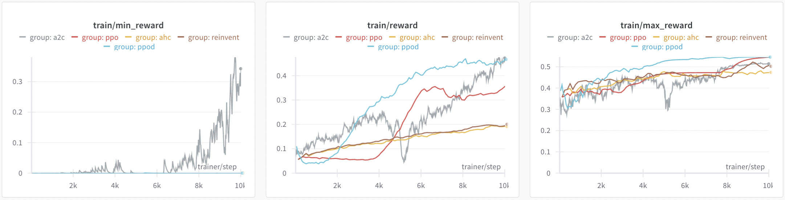
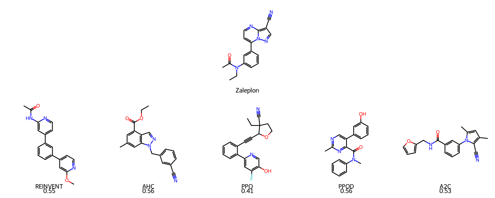

  

# AceGen: A TorchRL-based toolkit for reinforcement learning in generative chemistry

---

## Overview

AceGen is a comprehensive toolkit designed to leverage reinforcement learning (RL) techniques for generative chemistry tasks, particularly in drug design. AceGen harnesses the capabilities of TorchRL, a modern library for general decision-making tasks, to provide a flexible and integrated solution for generative drug design challenges.

The full paper can be found [here](https://arxiv.org/abs/2405.04657).

---

## Features

- **Multiple Generative Modes:** AceGen facilitates the generation of chemical libraries with different modes: de novo generation, scaffold decoration, and fragment linking.
- **RL Algorithms:** AceGen offers task optimization with various reinforcement learning algorithms such as Proximal Policy Optimization (PPO), Advantage Actor-Critic (A2C), Reinforce, Reinvent, and Augmented Hill-Climb (AHC).
- **Pre-trained Models:** The toolkit offers pre-trained models including Gated Recurrent Unit (GRU), Long Short-Term Memory (LSTM), and GPT-2.
- **Scoring Functions :** AceGen relies on MolScore, a comprehensive scoring function suite for generative chemistry, to evaluate the quality of the generated molecules.
- **Customization Support:** AceGen provides tutorials for integrating custom models and custom scoring functions, ensuring flexibility for advanced users.

---

---

## Installation

### Conda environment

To create the conda / mamba environment, run

    conda create -n acegen python=3.10 -y
    conda activate acegen
    pip3 install --pre torch --index-url https://download.pytorch.org/whl/nightly/cu121
    
### Install Tensordict

To install Tensordict, run

    git clone https://github.com/pytorch/tensordict.git
    cd tensordict
    python setup.py install

### Install TorchRL

To install TorchRL, run

    git clone https://github.com/pytorch/rl.git
    cd rl
    python setup.py install

### Install AceGen

To install AceGen, run (use `pip install -e ./` for develop mode)

    pip3 install tqdm wandb hydra-core
    git clone https://github.com/Acellera/acegen-open.git
    cd acegen-open
    pip install ./

### Optional dependencies

Unless you intend to define your own custom scoring functions, install MolScore by running

    pip3 install MolScore

To use the scaffold decoration and fragment linking, install promptsmiles by running

    pip3 install promptsmiles

To learn how to configure constrained molecule generation with AcGen and promptsmiles, please refer to this [tutorial](tutorials/using_promptsmiles.md).

---

## Running training scripts

To run the training scripts for denovo generation, run the following commands:
    
    python scripts/reinforce/reinforce.py --config-name config_denovo
    python scripts/a2c/a2c.py --config-name config_denovo
    python scripts/ppo/ppo.py --config-name config_denovo
    python scripts/reinvent/reinvent.py --config-name config_denovo
    python scripts/ahc/ahc.py --config-name config_denovo

To run the training scripts for scaffold decoration, run the following commands (requires installation of promptsmiles):

    python scripts/reinforce/reinforce.py --config-name config_scaffold
    python scripts/a2c/a2c.py --config-name config_scaffold
    python scripts/ppo/ppo.py --config-name config_scaffold
    python scripts/reinvent/reinvent.py --config-name config_scaffold
    python scripts/ahc/ahc.py --config-name config_scaffold

To run the training scripts for fragment linking, run the following commands (requires installation of promptsmiles):

    python scripts/reinforce/reinforce.py --config-name config_linking
    python scripts/a2c/a2c.py --config-name config_linking
    python scripts/ppo/ppo.py --config-name config_linking
    python scripts/reinvent/reinvent.py --config-name config_linking
    python scripts/ahc/ahc.py --config-name config_linking

To modify training parameters, edit the corresponding YAML file in each example's directory.

#### Advanced usage

Scripts are also available as executables after installation, but both the path and name of the config must be specified. For example,

    ppo.py --config-path=<path_to_config_dir> --config-name=<config_name.yaml> 

YAML config parameters can also be specified on the command line. For example,

    ppo.py --config-path=<path_to_config_dir> --config-name=<config_name.yaml> total_smiles=100

---

# Available models

We provide a variety of example priors that can be selected in the configuration file. These include:

- A Gated Recurrent Unit (GRU) model
  - pre-training dataset1 (default): [ChEMBL](https://www.ebi.ac.uk/chembl/)
  - pre-training dataset2: [ZINC250k](https://github.com/wenhao-gao/mol_opt/blob/main/data/zinc.txt.gz)
  - umber of parameters: 4,363,045

- A Long Short-Term Memory (LSTM) model
  - pre-training dataset: [ChEMBL](https://www.ebi.ac.uk/chembl/)
  - number of parameters: 5,807,909
 

- A GPT-2 model (requires installation of HuggingFace's `transformers` library)
  - pre-training dataset: [REAL 350/3 lead-like, 613.86M cpds, CXSMILES](https://enamine.net/compound-collections/real-compounds/real-database-subsets)
  - number of parameters: 5,030,400

---

# Changing the scoring function

To change the scoring function, adjust the `molscore` parameter in any configuration files. Set it to point to a valid 
MolScore configuration file (e.g.  ../MolScore/molscore/configs/GuacaMol/Albuterol_similarity.json). 
Alternatively, you can set the `molscore` parameter to the name of a valid MolScore benchmark 
(such as MolOpt, GuacaMol, etc.) to automatically execute each task in the benchmark. For further details on MolScore, 
please refer to the [MolScore](https://github.com/MorganCThomas/MolScore) repository.

Alternatively, users can define their own custom scoring functions and use them in the AceGen scripts by following the 
instructions in this [tutorial](tutorials/adding_custom_scoring_function.md).

---

# Integration of custom models

We encourage users to integrate their own models into AceGen.

`/acegen/models/gru.py` and `/acegen/models/lstm.py` offer methods to create RNNs of varying sizes, which can be use
to load custom models. 

Similarly, `/acegen/models/gpt2.py` can serve as a template for integrating HuggingFace models. A detailed guide 
on integrating custom models can be found in this [tutorial](tutorials/adding_custom_model.md).

---

# Results on the [MolOpt](https://arxiv.org/pdf/2206.12411.pdf) benchmark

Algorithm comparison for the Area Under the Curve (AUC) of the top 100 molecules on MolOpt benchmark scoring functions. 
Each algorithm ran 5 times with different seeds, and results were averaged. 
We used the default configuration for each algorithm, including the GRU model for the prior.
Additionally, for Reinvent we also tested the configuration proposed in the MolOpt paper.

| Task                          | Reinvent | Reinvent MolOpt | AHC   | A2C   | PPO   | PPOD  |
|-------------------------------|----------|-----------------|-------|-------|-------|-------|
| Albuterol_similarity         | 0.569    | 0.865           | 0.640 | 0.760 | 0.911 | **0.919** |
| Amlodipine_MPO               | 0.506    | 0.626           | 0.505 | 0.511 | 0.553 | **0.656** |
| C7H8N2O2                     | 0.615    | 0.871           | 0.563 | 0.737 | 0.864 | **0.875** |
| C9H10N2O2PF2Cl               | 0.556    | 0.721           | 0.553 | 0.610 | 0.625 | **0.756** |
| Celecoxxib_rediscovery       | 0.566    | 0.812           | 0.590 | 0.700 | 0.647 | **0.888** |
| Deco_hop                     | 0.602    | **0.657**       | 0.616 | 0.605 | 0.601 | 0.646 |
| Fexofenadine_MPO             | 0.668    | **0.765**       | 0.680 | 0.663 | 0.687 | 0.747 |
| Median_molecules_1           | 0.199    | 0.348           | 0.197 | 0.321 | 0.362 | **0.363** |
| Median_molecules_2           | 0.195    | 0.270           | 0.208 | 0.224 | 0.236 | **0.285** |
| Mestranol_similarity         | 0.454    | 0.821           | 0.514 | 0.645 | 0.728 | **0.870** |
| Osimertinib_MPO              | 0.782    | **0.837**       | 0.791 | 0.780 | 0.798 | 0.815 |
| Perindopril_MPO              | 0.430    | **0.516**       | 0.431 | 0.444 | 0.477 | 0.506 |
| QED                           | 0.922    | 0.931           | 0.925 | 0.927 | **0.933** | **0.933** |
| Ranolazine_MPO               | 0.626    | **0.721**       | 0.635 | 0.681 | 0.681 | 0.706 |
| Scaffold_hop                 | 0.758    | **0.834**       | 0.772 | 0.764 | 0.761 | 0.808 |
| Sitagliptin_MPO              | 0.226    | 0.356           | 0.219 | 0.272 | 0.295 | **0.372** |
| Thiothixene_rediscovery      | 0.350    | 0.539           | 0.385 | 0.446 | 0.473 | **0.570** |
| Troglitazone_rediscovery     | 0.256    | 0.447           | 0.282 | 0.305 | 0.449 | 0.511 |
| Valsartan_smarts             | 0.012    | 0.014           | 0.011 | 0.010 | **0.022** | **0.022** |
| Zaleplon_MPO                 | 0.408    | **0.496**       | 0.412 | 0.415 | 0.469 | 0.490 |
| DRD2                          | 0.907    | **0.963**       | 0.906 | 0.942 | **0.967** | 0.963 |
| GSK3B                         | 0.738    | 0.890           | 0.719 | 0.781 | 0.863 | **0.891** |
| JNK3                          | 0.640    | 0.817           | 0.649 | 0.660 | 0.770 | **0.842** |
| **Total**                     | **11.985** | **15.118**    | **12.205** | **13.203** | **14.170** | **15.434** |
